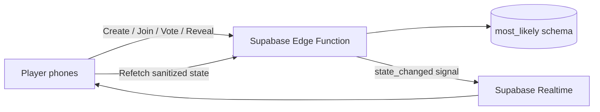

<div align="center">

# WHO WOULD?

### Your friends vote. The room decides.

A realtime multiplayer party game for **3–10 friends** — join from any phone, vote secretly, reveal the chaos, and see what the group really thinks.

[](https://most-likely-azure.vercel.app)

[](https://github.com/Rishikeshsanin/MostLikely/actions/workflows/ci.yml)


**No accounts · No downloads · No explanations**

</div>

---

## What is WHO WOULD?

**WHO WOULD?** is a mobile-first social voting game built for people sitting together in the same room.

One player creates a room. Everyone else joins using a **4-digit code or QR link**. A question appears on every phone — for example:

> **Who would most likely get arrested?**

Everyone secretly votes for any player in the room, **including themselves**, and the Host reveals the result when the room is ready.

The fun is not just the winner. The game tracks voting patterns across the whole session and turns them into **category awards, session awards, receipts, landslides, ties, unanimous moments, and final rankings**.

### Why it feels different

| | |
|---|---|
| ⚡ **Instant rooms** | Create and join in seconds — no signup flow |
| 🗳️ **Secret voting** | Nobody can inspect who voted for whom before reveal |
| 📱 **One phone per player** | Everyone plays from their own device in realtime |
| 👀 **Synchronized reveal** | Every screen enters the reveal together |
| 🧠 **255 curated questions** | Chill, Chaos, Savage, Wholesome and ambition/social packs |
| ✍️ **Custom questions** | The Host can add questions made for the group |
| 🏆 **Session awards** | Final awards are calculated from actual voting data |
| 🔁 **Reconnect support** | Refreshing the page restores the same player session |
| 📲 **Installable PWA** | Works like an app without an app-store install |
| 🎯 **Self-voting** | If the answer is you, you can vote for yourself |

---

## How a game works

```text
Create room
    ↓
Friends join with code / QR
    ↓
Host chooses a question pack
    ↓
Question appears on every phone
    ↓
Everyone votes secretly
    ↓
Host reveals
    ↓
Results + special outcome
    ↓
Next question
    ↓
Final awards + receipts
```

### Example round

**Question**

> Who would survive the longest in a zombie apocalypse?

Four players vote:

```text
Rishi   ██████████  2 votes
Aman    █████       1 vote
Sara    █████       1 vote
```

The reveal is synchronized across the room, then the Host can immediately move to the next round.

---

## Game modes & question packs

| Pack | Energy |
|---|---|
| **Mixed** | Best all-round party set |
| **Chill** | Funny, casual and easy |
| **Chaos** | Bad decisions and questionable life choices |
| **Savage** | Roast-level honesty for close friends |
| **Wholesome** | Trust, loyalty and genuinely nice questions |

The built-in bank contains **255 hand-curated questions** with topic balancing so the room does not keep getting the same kind of question repeatedly.

Hosts can also add up to **15 custom questions** for inside jokes, college groups, trips, parties, teams, or anything else.

---

## Realtime multiplayer

The game is server-authoritative rather than trusting each browser to decide what happened.



Realtime messages contain only a **state-change signal**. Phones then request the latest sanitized game state using their room session token.

That keeps raw vote records on the backend while still making the room feel instant.

---

## Reveal logic

Rounds can produce more than a normal winner:

- **Unanimous** — the entire room picked the same person
- **Tie** — multiple players share the highest vote count
- **Landslide** — one player dominates the vote
- **No consensus** — the room is completely split
- **Normal result** — a regular winner and distribution

At the end of the session, the engine can generate data-backed awards such as:

- **MOST CHAOTIC**
- **MOST TRUSTED**
- **FUTURE MILLIONAIRE**
- **COMEDY DEPARTMENT**
- **THE REAL ONE**
- **MAIN CHARACTER**
- **BIGGEST TARGET**
- **LANDSLIDE LEGEND**

Category awards are only produced when enough relevant questions were actually played — they are not random labels.

---

## Tech stack

| Layer | Technology |
|---|---|
| Frontend | Next.js 16, React 19, TypeScript |
| Styling | Custom responsive CSS |
| Realtime | Supabase Realtime Broadcast |
| Backend | Supabase Edge Functions |
| Database | PostgreSQL / Supabase |
| QR joining | `qrcode.react` |
| Testing | Vitest |
| Hosting | Vercel |
| CI | GitHub Actions |

---

## Privacy & game integrity

Secret voting is enforced on the backend, not just hidden in the UI.

- browsers have **no direct table access**
- raw voter → target rows are never sent to players
- only aggregate results are returned after reveal
- one vote per player per round is database-enforced
- Host actions are validated server-side
- player sessions use opaque random tokens
- only SHA-256 token hashes are stored in the database
- Host cannot inspect vote targets before reveal

---

## Project Hub isolation

This app shares an existing Supabase **Project Hub**, but operates inside its own registered boundary:

```text
most_likely.*
```

Every gameplay query is fully qualified to that schema. The app does not create ordinary game tables in `public`, does not create cross-app foreign keys, and does not modify another application's Auth, Storage, schemas, extensions, keys, or project-wide settings.

Before gameplay database operations, the backend verifies the registered Hub boundary:

```sql
select hub.assert_app_scope('most_likely', 'most_likely');
```

The repository also includes:

```text
AGENTS.md
SUPABASE_HUB_RULES.md
```

Those files document the isolation contract for future development.

---

## Project structure

```text
MostLikely/
├── src/
│   ├── app/                    # Next.js routes
│   ├── components/             # Game UI
│   └── lib/                    # API, realtime, sessions, types
├── public/                     # PWA assets
├── supabase/
│   ├── functions/game-api/     # Authoritative multiplayer backend
│   └── migrations/             # most_likely database schema
├── scripts/                    # Production smoke tests
├── tests/                      # Game-engine tests
├── AGENTS.md
└── SUPABASE_HUB_RULES.md
```

---

## Run locally

### Requirements

- Node.js **22+**
- npm
- Supabase project configuration

### Setup

```bash
git clone https://github.com/Rishikeshsanin/MostLikely.git
cd MostLikely
npm install
cp .env.example .env.local
npm run dev
```

Then open:

```text
http://localhost:3000
```

### Environment variables

```env
NEXT_PUBLIC_SUPABASE_URL=https://YOUR_PROJECT.supabase.co
NEXT_PUBLIC_SUPABASE_PUBLISHABLE_KEY=sb_publishable_...
```

No database password, service-role key, or privileged backend credential is shipped to the browser.

---

## Useful commands

```bash
npm run dev        # Start local development
npm run build      # Production build
npm run start      # Start production server
npm run typecheck  # Strict TypeScript check
npm test           # Run game-engine tests
```

The GitHub Actions pipeline additionally runs a dependency security audit and a **live multiplayer backend smoke test**.

---

## Production status

| System | Status |
|---|---|
| Frontend | ✅ Live on Vercel |
| GitHub CI | ✅ Tests + typecheck + production build |
| Multiplayer backend | ✅ Deployed |
| Database | ✅ Isolated `most_likely` schema |
| Realtime | ✅ Broadcast + polling fallback |
| Multiplayer smoke test | ✅ Passing |
| PWA | ✅ Installable |

### Play it

**https://most-likely-azure.vercel.app**

---

## Built around one rule

> **The vote stays secret until the room decides to reveal it.**

That rule drives the UI, backend, realtime architecture, database permissions, and the entire game flow.

<div align="center">

### WHO WOULD?

**Create a room. Expose your friends. Accept the consequences.**

[Play the game](https://most-likely-azure.vercel.app)

</div>
